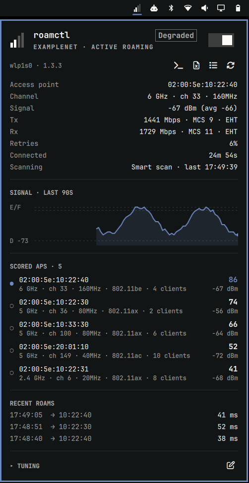
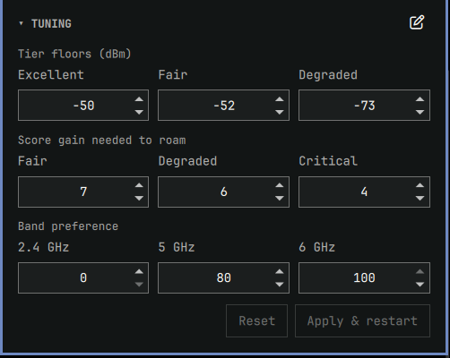

# roamctl for Omarchy
An Omarchy bar widget for [roamctl](https://github.com/jwil007/roamctl), a configurable Wi-Fi roaming service that replaces wpa_supplicant's `bgscan`. The widget shows roamctl's live state, lets you tune the main roaming parameters from the panel, and logs every roam with the scan results roamctl used to make the decision.

<p>
  
  &nbsp;
  
</p>

## Install
```
omarchy plugin add https://github.com/jwil007/omarchy-roamctl.git
```
Open the widget and click **Install roamctl**, or run:
```
~/.config/omarchy/plugins/jwil007.roamctl/bin/roamctl-omarchy install
```
Then use the switch in the panel to enable roaming.

Requires NetworkManager with wpa_supplicant. iwd is not supported, since roamctl uses the wpa_supplicant control interface.

### What install changes
- Downloads the latest roamctl release, verifies the SHA-256 checksums, and installs `roamctl` and `roamctl-tui` to `/usr/local/bin` along with the upstream `roamctl@.service` unit.
- Adds a drop-in at `/etc/systemd/system/roamctl@.service.d/omarchy.conf` that gives the `wheel` group access to roamctl's IPC socket and config file. The socket is broadcast-only (roamctl never reads from it), and `wheel` can already sudo.
- Adds a polkit rule at `/etc/polkit-1/rules.d/50-roamctl-omarchy.rules` that lets an active local `wheel` session start, stop, and restart `roamctl@` units without a password. It does not cover any other unit. Enabling and disabling the unit still requires authorization.

Run `install` again to upgrade. If roamctl is already installed, `setup` (or **Enable quick tuning** in the panel) adds only the permissions. `uninstall` removes everything except your config.

## Features

### Bar icon
Four bars show roamctl's current roaming tier, from Excellent (roaming paused) to Critical (aggressive roaming). The icon changes to the urgent color at Critical and pulses while a roam is in progress. State is read directly from roamctl's IPC socket; `iw` and NetworkManager are not polled.

- Left-click: open the panel
- Middle-click: open `roamctl-tui`
- Right-click: start/stop roamctl

### Panel
- Current AP, band, channel, RSSI and average RSSI, Tx/Rx rate, MCS, retry rate, and scan state
- Candidate APs with their live scores. This is the same ranked list roamctl roams from.
- 90-second RSSI graph with the Excellent, Fair, and Degraded floors drawn as lines
- Recent roams

Keyboard shortcuts: `t` TUI, `e` export, `c` config, `l` logs, `r` restart, `Enter` enable/disable.

### Tuning
Tier RSSI floors, per-tier score deltas, and band preference can be changed in the panel. **Apply & restart** writes the config and restarts roamctl. Changes are checked against a copy of roamctl's validation rules before anything is written to `/etc`, so an invalid config is never saved. Comments in the config file are preserved.

The pencil icon opens the full TOML config in your editor. When the editor closes, the config is validated, saved, and roamctl is restarted. If validation fails, nothing is written and you can edit again or discard. The previous version is saved to `~/.local/state/roamctl-omarchy/<file>.prev`.

### Notifications
A notification is sent for each roam with the target AP, band, channel, RSSI, and roam duration in ms. Successful roams are sent at low urgency, failed roams at normal urgency. Disable with the `notifyRoams` setting.

### Roam log and CSV export
Every roam is logged with the scored scan list roamctl chose the target from, along with roamctl's journal lines for that roam. Export writes a CSV with one row per candidate AP per roam:

| roam | tier | required delta | candidate | rank | RSSI | score | delta vs current | meets delta | target |
|---|---|---|---|---|---|---|---|---|---|
| 1 | active_roaming | 6 | 02:00:5e:10:22:40 | 1 | -58 | 75 | +11 | yes | yes |
| 1 | active_roaming | 6 | 02:00:5e:10:33:30 | 2 | -52 | 69 | +5 | no | |
| 1 | active_roaming | 6 | 02:00:5e:10:22:30 | 3 | -53 | 64 | 0 | (current) | |

The export also includes each score component (RSSI, SNR, band, channel width, utilization, PHY), the hysteresis override threshold, penalized APs, the full config in effect, and the connection before and after the roam. If roamctl's result line doesn't match the BSSID the station actually ended up on, the row is flagged.

## How the roam log works
The plugin reads every IPC frame (about 100 ms apart). For each completed roam, it appends one JSON object to `~/.local/state/roamctl-omarchy/roams-<iface>.jsonl`. The file is rotated at 20 MB. Each entry contains:

- `result`: target and final BSSID, duration, result flag, message
- `decision`: the scored `BSSList` from the first frame published with `RoamInProgress` set. roamctl scores the scan and publishes that snapshot as it starts the roam, so this is the list the target was chosen from. Roams shorter than one frame fall back to the previous frame (see `decision.source`). Also includes the tier, required delta, hysteresis and health flags, and connection metrics.
- `after`: the connection once the station reports the final BSSID, or after 3 s (see `after.settled`)
- `journal`: roamctl's log lines for the roam window, including candidate evaluation with scaled score components, measured and required delta, and the result
- `penalties`: APs excluded after failed roams
- `config`: the full roamctl config

Roams are logged whenever the Omarchy shell is running, including when the panel is closed.

> [!NOTE]
> Roams requested by the AP through 802.11v BSS Transition Management are not scored by roamctl, so score deltas will not explain them.

## Reference
```
roamctl-omarchy install|setup|uninstall
roamctl-omarchy status|enable|disable|restart|tui|config|logs|export [iface]
roamctl-omarchy apply <iface> section.key=value...
roamctl-config get|check FILE
roamctl-config set FILE section.key=value...
roamctl-export LOG.jsonl... -o OUT.csv
```

Shell IPC:
```
omarchy-shell jwil007.roamctl toggle|open|close|tuning|tui|exportRoams|enable|disable|status
```

Settings are stored in the widget's entry in `~/.config/omarchy/shell.json`:

| key              | default | description                                    |
|------------------|---------|------------------------------------------------|
| `iface`          | `""`    | Wireless interface. Empty uses the first found. |
| `notifyRoams`    | `true`  | Send a notification on each roam                |
| `candidateCount` | `5`     | Number of scored APs listed in the panel        |

## License
MIT
